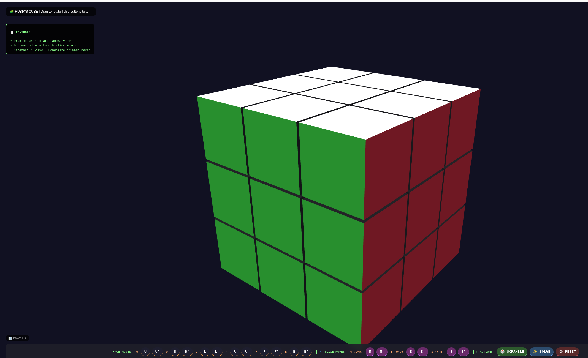

# 🧩 Interactive 3D Rubik’s Cube

A fully interactive, locally hosted Rubik’s Cube built with Three.js and vanilla JavaScript. Rotate the camera, make moves with buttons, scramble, and solve by undoing your move history.



## ✨ Features

- **Fully 3D** – Realistic colors, lighting, and smooth animations
- **Complete move set** – All face turns (U, D, L, R, F, B) and slice moves (M, E, S)
- **Keyboard‑free controls** – Use on‑screen buttons for all moves
- **Scramble** – Randomizes the cube with 45–80 random moves
- **Solve** – Reverses your entire move history (undoes everything you did) – 100% reliable
- **Reset** – Returns the cube to solved state instantly
- **Camera control** – Drag to rotate view, scroll to zoom
- **Move counter** – Tracks total moves performed
- **Responsive UI** – Works on desktop and mobile devices

## 🖱️ Controls

| Action                    | How to do it                     |
|---------------------------|----------------------------------|
| Rotate camera             | Drag mouse / finger              |
| Zoom                      | Scroll / pinch                   |
| Turn a face               | Click U, D, L, R, F, B buttons   |
| Turn in opposite direction| Click U', D', etc.               |
| Slice moves (M, E, S)     | Click M, M', E, E', S, S' buttons|
| Randomize cube            | Click **SCRAMBLE** |
| Solve cube                | Click **SOLVE** (undoes all moves)|
| Reset to solved           | Click **RESET** |

> **Note:** The cube is controlled entirely by buttons. Clicking directly on the 3D model does nothing (prevents accidental moves).

## 🚀 How to Run Locally

1. **Clone the repository**
   ```bash
   git clone [https://github.com/ldhagen/deepseek_rubiks_cube_interactive_display.git](https://github.com/ldhagen/deepseek_rubiks_cube_interactive_display.git)
   cd deepseek_rubiks_cube_interactive_display
